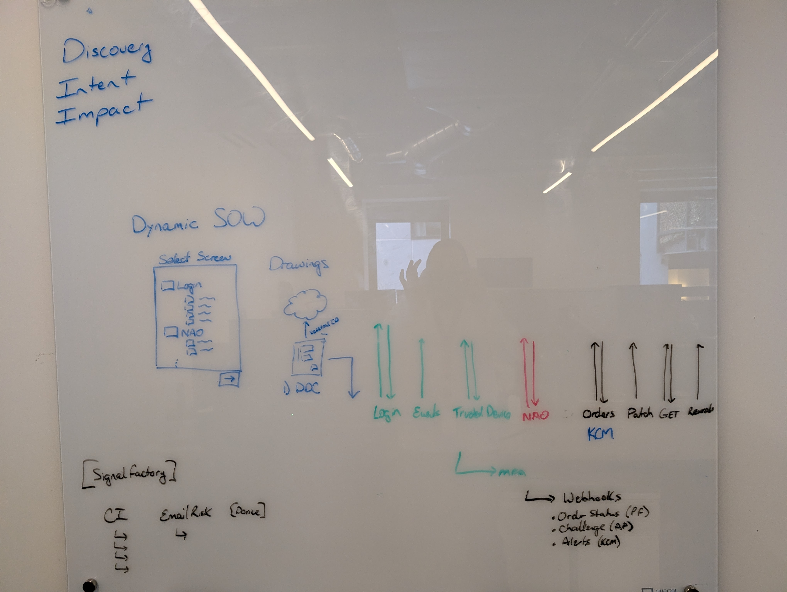

# Dynamic SOW - Flowchart Generator

An interactive web application for generating and exporting product flowcharts. Select a product to view its architecture diagram, then export as SVG or PNG to share with clients.



## Features

- **Interactive Product Selection**: Click on product cards to instantly view flowcharts
- **Live Rendering**: Flowcharts render in real-time using Mermaid.js with custom theming
- **Multiple Export Formats**: Download as SVG (scalable vector) or PNG (high-resolution 2x image)
- **Smart Layout**: Subgraph grouping for clean left-to-right flow visualization
- **Responsive Design**: Bootstrap 5 offcanvas sidebar — fixed panel on desktop, slide-in drawer on mobile
- **Extensible Architecture**: Data-driven design makes adding new products simple
- **No Build Required**: Pure HTML/CSS/JavaScript with CDN libraries

## Current Implementation

**NAO (New Account Opening)** - Fully implemented flowchart showing:
- Website signup flow with form fields (FirstName, LastName, Email, Phone)
- DDC (Data Device Collector) integration
- NAO API with Name Template and MFA processing
- K360 Policies & Segments decision engine
- Three outcomes: ALLOW, BLOCK, CHALLENGE
- MFA challenge flow with Kount or Client verification
- Success/Failure paths leading to Continue or End states

**📋 Project Planning:** See [plan.md](plan.md) for detailed roadmap, backlog, and implementation tracking.
**🎯 GitHub Project Board:** [View active tasks and progress](https://github.com/timLP79/dynamic-sow/projects)
**📝 GitHub Issues:** [View all issues](https://github.com/timLP79/dynamic-sow/issues)

## Quick Start

### Running Locally

**IMPORTANT:** Due to ES6 module security restrictions, you must use a local web server. You cannot simply open `index.html` in your browser.

**Option 1: Python Web Server (Recommended)**
```bash
cd /path/to/dynamic-sow
python3 -m http.server 8000
```
Then open http://localhost:8000 in your browser.

**Option 2: Node.js http-server**
```bash
npx http-server -p 8000
```

**Option 3: VS Code Live Server**
If using VS Code, install the "Live Server" extension and click "Go Live" button.

### Using the App

1. Click on a product card (e.g., NAO) in the left panel
2. The flowchart renders automatically in the right panel
3. Use "Download SVG" or "Download PNG" buttons to export
4. Stop the server with `Ctrl+C` when done

### Deploying to GitHub Pages

GitHub Pages serves files over HTTP, so ES6 modules work perfectly!

1. Repository: https://github.com/timLP79/dynamic-sow
2. Go to repository **Settings** → **Pages**
3. Set source to `main` branch, root folder
4. Your app will be live at `https://timLP79.github.io/dynamic-sow/`

**Note:** No special configuration needed - it works as a static site!

## Project Structure

```
dynamic-sow/
├── index.html              # Main application page
├── css/
│   └── main.css           # All styles (layout, components, responsive)
├── js/
│   ├── app.js             # Main application controller
│   ├── exporter.js        # SVG/PNG export functionality
│   ├── flowchart-data.js  # Product definitions and Mermaid code
│   └── renderer.js        # Mermaid.js rendering logic
├── plan/
│   ├── NAO.txt            # NAO flowchart Mermaid code reference
│   └── PXL_20260209_213536921.jpg  # Original whiteboard design photo
├── plan.md                # Project roadmap and tracking
└── README.md              # User documentation

4 directories, 10 files
```

### Key Files

- **index.html**: Single-page application with Bootstrap 5 two-panel layout (offcanvas sidebar + flowchart display)
- **css/main.css**: Custom styles layered on Bootstrap 5 — product cards, Mermaid diagram sizing, scrollbar, color variables
- **js/flowchart-data.js**: Central repository for all product flowchart definitions (currently: NAO)
- **js/renderer.js**: Mermaid.js initialization and flowchart rendering engine
- **js/exporter.js**: Export functionality for SVG and PNG formats with auto-generated filenames
- **js/app.js**: Application controller managing UI state, product selection, and module coordination
- **plan/**: Design reference materials (original whiteboard photo and Mermaid source)

## Usage

### Viewing Flowcharts

1. The left panel shows available product cards
2. Click on any product card to view its flowchart
3. The selected card will highlight in blue
4. The flowchart renders automatically in the right panel

### Exporting Flowcharts

**SVG Export** (Recommended for editing):
- Click "Download SVG"
- File saves as `productname-flowchart-YYYY-MM-DD.svg`
- Can be opened in browsers, Illustrator, Inkscape, etc.
- Scalable vector format (infinite zoom without quality loss)

**PNG Export** (Best for emails/presentations):
- Click "Download PNG"
- File saves as `productname-flowchart-YYYY-MM-DD.png`
- High-resolution (2x) bitmap image
- Ready to embed in emails, documents, slides

## Adding New Products

The application is designed to make adding new products easy:

### Step 1: Add Product Data

Open `js/flowchart-data.js` and add a new entry:

```javascript
export const FlowchartData = {
  NAO: { /* existing NAO data */ },

  // Add your new product here:
  LOGO: {
    id: 'logo',
    name: 'Logo',
    description: 'Logo product architecture flow',
    mermaidCode: `flowchart LR
      LOGO_A[Start] --> LOGO_B[Process]
      LOGO_B --> LOGO_C[End]`
  }
};
```

### Step 2: That's It!

The product card will automatically appear in the UI. No other code changes needed.

### ⚠️ Node ID Naming Convention (Required)

Every flowchart **must** prefix all node IDs with `PRODUCTNAME_` to avoid conflicts when switching between flowcharts. See [#21](https://github.com/timLP79/dynamic-sow/issues/21).

```
NAO flowchart:    NAO_Input,   NAO_A,   NAO_B,   NAO_D ...
LOGIN flowchart:  LOGIN_Input, LOGIN_A, LOGIN_B, LOGIN_D ...
SIG flowchart:    SIG_Input,   SIG_A,   SIG_B,   SIG_D ...
DDC flowchart:    DDC_Input,   DDC_A,   DDC_B,   DDC_D ...
```

**Important distinction:**
- **Node IDs** (the short identifiers like `NAO_A`) → must be unique across all flowcharts
- **Node labels** (the visible text like `"-- Website --"`) → can be reused freely

**Why?** Mermaid caches node IDs internally during a page session. Duplicate IDs across diagrams cause the second flowchart to fail silently.

### Tips for Creating Good Flowcharts

**Layout Best Practices:**
- Use `flowchart LR` for left-to-right flow (most readable for process flows)
- Group related items in subgraphs: `subgraph PROD_Name[" "] ... end`
- Use empty labels `[" "]` for cleaner subgraph appearance
- Stack items vertically in subgraphs with `direction TB` to save horizontal space
- Use `<br/>` for multi-line text in nodes
- Use `%%` for comments: `%%PROD_NodeA --> PROD_NodeB`

**Example with subgraphs and correct node IDs:**
```javascript
mermaidCode: `flowchart LR
    subgraph LOGO_Input[" "]
        LOGO_A[Website]
        LOGO_B[DDC]
    end

    subgraph LOGO_Outcomes[" "]
        LOGO_D[ALLOW]
        LOGO_E[BLOCK]
        LOGO_F[CHALLENGE]
    end

    LOGO_Input -->|API Call| LOGO_Outcomes
`
```

### Mermaid Syntax Guide

Mermaid uses simple text syntax to create diagrams. Here are some basics:

```
flowchart LR                    # Left-to-right flow
flowchart TD                    # Top-down flow

A[Box] --> B[Another Box]       # Arrow connection
A -.-> B                        # Dotted line
A ==> B                         # Thick arrow

C{Decision}                     # Diamond shape
D([Rounded])                    # Rounded box
E[(Database)]                   # Cylinder shape

subgraph Group1                 # Group boxes together
  F --> G
end
```

Full documentation: [Mermaid.js Flowchart Docs](https://mermaid.js.org/syntax/flowchart.html)

## Technology Stack

- **HTML5/CSS3/JavaScript (ES6 Modules)**: Core application
- **Bootstrap 5.3.3**: Layout, responsive offcanvas sidebar, buttons (CDN)
- **Mermaid.js v10**: Flowchart rendering engine (CDN)
- **html2canvas 1.4.1**: PNG export functionality (CDN)
- **Zero Dependencies**: No npm, webpack, or build process
- **Static Files Only**: Can be served from any web server or GitHub Pages

**Total Application Size**: ~15KB (before compression, excluding CDN libraries)

## Browser Compatibility

- Chrome 90+ ✅
- Firefox 88+ ✅
- Safari 14+ ✅
- Edge 90+ ✅

Requires modern browser with ES6 module support.

## Customization

### Changing Colors

Edit CSS variables in `css/main.css`:

```css
:root {
  --primary-blue: #2563eb;      /* Change primary color */
  --bg-light: #f8fafc;          /* Background color */
  --text-dark: #1e293b;         /* Text color */
}
```

### Changing Mermaid Theme

Edit `js/renderer.js`:

```javascript
window.mermaid.initialize({
  theme: 'default',  // Options: default, neutral, dark, forest
  // ... other settings
});
```

## Troubleshooting

**Product cards don't appear / Blank page:**
- ⚠️ **MOST COMMON ISSUE:** You must use a local web server (see Quick Start)
- Opening `index.html` directly (`file://` protocol) blocks ES6 modules due to CORS
- Run `python3 -m http.server 8000` and access via `http://localhost:8000`
- Check browser console (F12) for CORS errors

**Flowchart doesn't render:**
- Check browser console for errors
- Verify Mermaid syntax is valid (use [Mermaid Live Editor](https://mermaid.live) to test)
- Ensure internet connection (libraries load from CDN)
- Try refreshing the page after code changes

**Flowchart layout issues:**
- Use subgraphs to group related items
- For compact horizontal layouts, stack subgraph contents vertically: `direction TB`
- Avoid very long node labels - use `<br/>` to break into multiple lines
- Test your Mermaid code at https://mermaid.live before adding to app

**Export buttons don't work:**
- Select a product first (buttons are disabled until flowchart loads)
- Check that flowchart has rendered successfully
- Verify browser allows downloads (check browser settings)
- For PNG export, ensure html2canvas loaded (check console)

**Mobile layout issues:**
- The sidebar is hidden on mobile — tap the hamburger icon (☰) in the top-left to open it
- After selecting a product, the sidebar closes automatically
- Flowcharts are horizontally scrollable on small screens

## Future Enhancements

Potential features to add:
- [ ] Multiple flowchart templates per product
- [ ] Dark mode toggle
- [ ] Shareable URLs with query parameters
- [ ] Flowchart customization (colors, themes)
- [ ] Print-optimized CSS
- [ ] Zoom/pan controls for large diagrams
- [ ] Client branding customization

## License

This project is open source and available for use in commercial and personal projects.

## Contributing

To contribute:
1. Fork the repository
2. Create a feature branch
3. Make your changes
4. Test thoroughly
5. Submit a pull request

## Support

For questions or issues, please open a GitHub issue or contact the maintainer.

---

## Quick Reference

### Common Commands

**Start Local Server:**
```bash
cd /run/host/var/home/tim/work-projects/dynamic-sow
python3 -m http.server 8000
```

**Test Mermaid Syntax:**
- Online Editor: https://mermaid.live
- Documentation: https://mermaid.js.org/syntax/flowchart.html

**Export Filenames:**
- Format: `{product-name}-flowchart-{YYYY-MM-DD}.{svg|png}`
- Example: `nao-flowchart-2026-02-09.svg`

### File Locations

- Add products: `js/flowchart-data.js`
- Styling: `css/main.css`
- Mermaid config: `js/renderer.js`
- Reference designs: `plan/`
- Project roadmap: `plan.md`
- GitHub Repository: [timLP79/dynamic-sow](https://github.com/timLP79/dynamic-sow)
- GitHub Issues: [View all issues](https://github.com/timLP79/dynamic-sow/issues)
- GitHub Project Board: [View board](https://github.com/timLP79/dynamic-sow/projects)

---

*Version 1.1 - February 2026*
